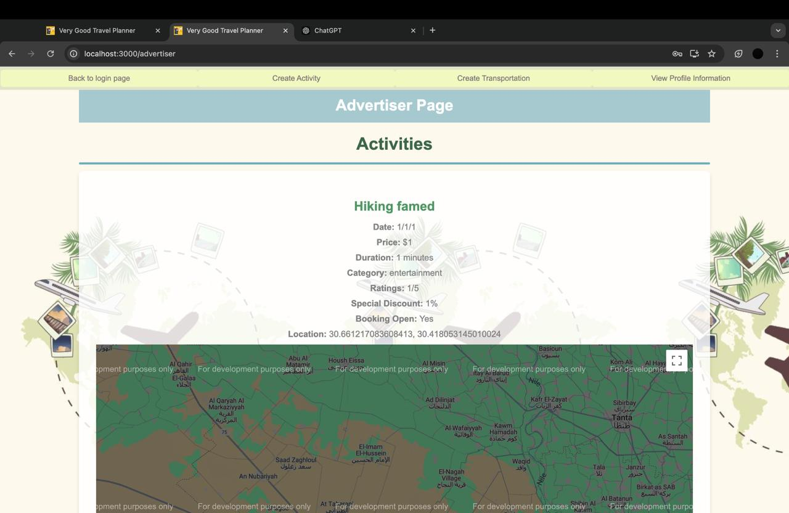
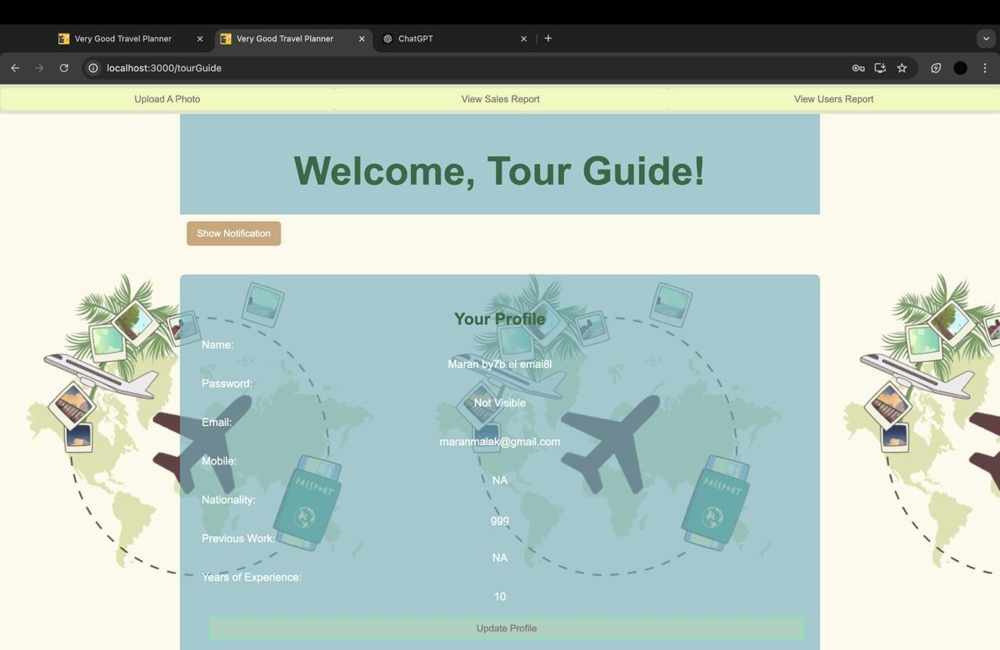
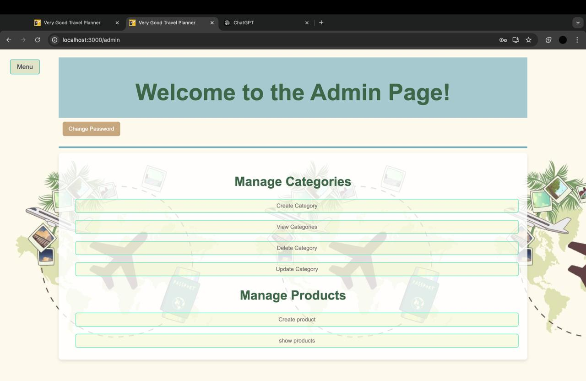
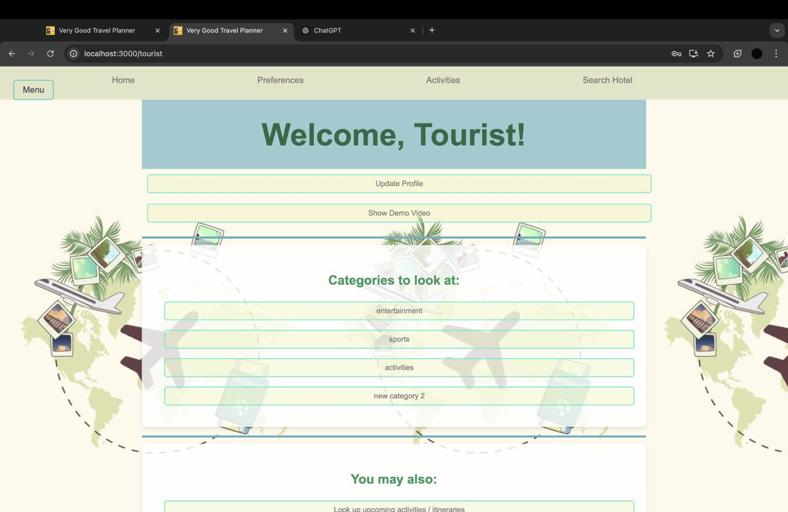
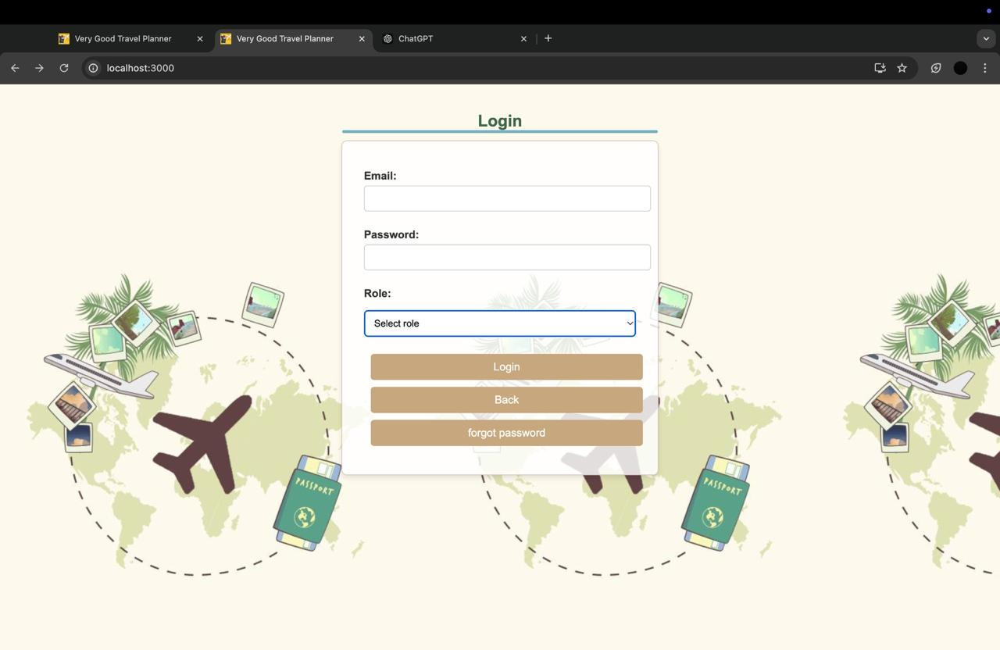
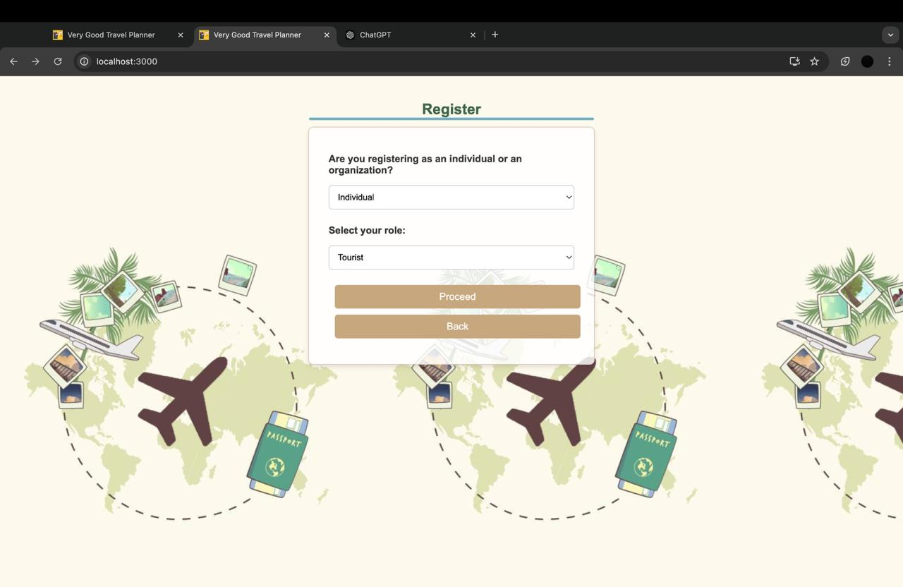
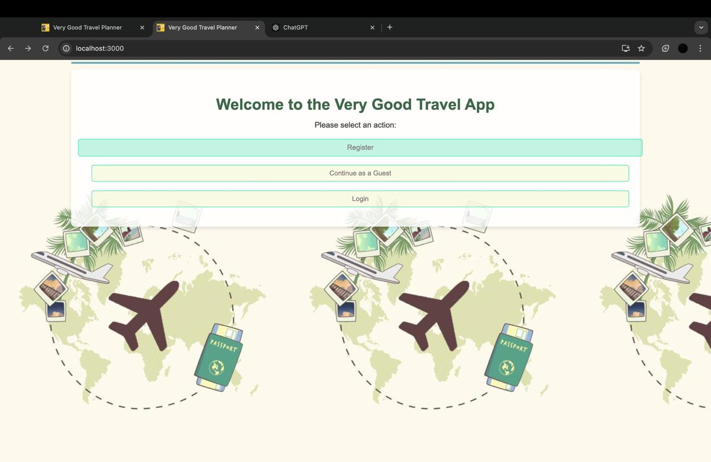
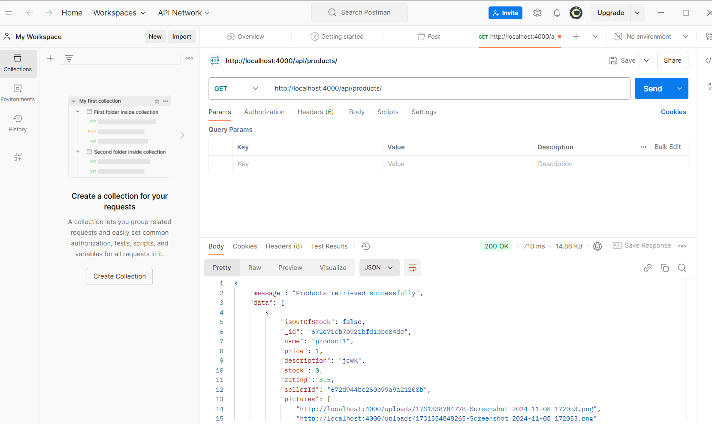
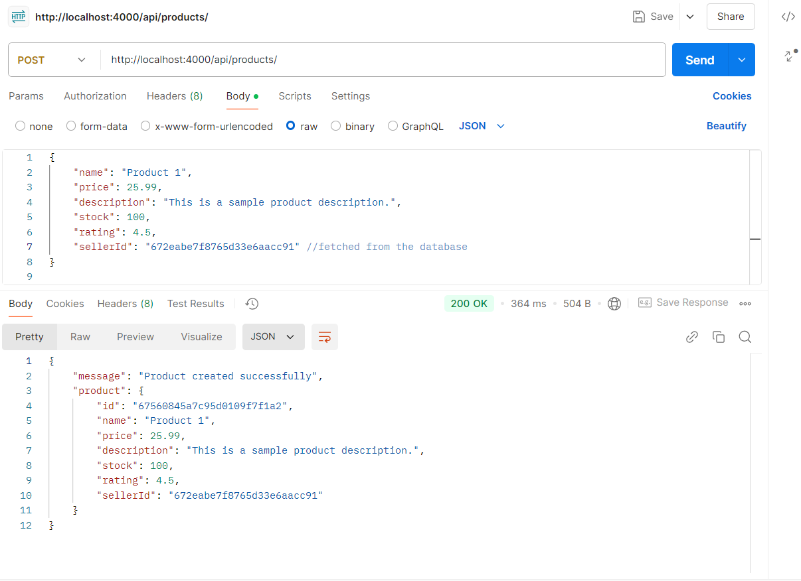
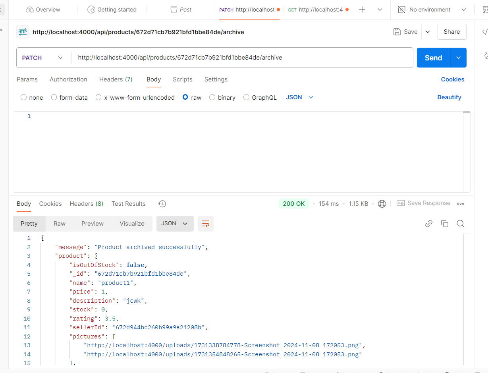

# Very Good Travel App

**A modern, feature-rich travel app designed to enhance your travel experience with ease and convenience.**

---

## Table of Contents

1. [Motivation](#motivation)  
2. [Build Status](#build-status)  
3. [Code Style](#code-style)  
4. [Screenshots](#screenshots)  
5. [Tech/Framework Used](#techframework-used)  
6. [Features](#features)  
7. [Code Examples](#code-examples)  
8. [Installation](#installation)  
9. [API References](#api-references)  
10. [Tests](#tests)  
11. [How to Use](#how-to-use)  
12. [Contribute](#contribute)  
13. [Credits](#credits)  
14. [License](#license)  

---

## Motivation

Travel planning should be simple, intuitive, and enjoyable. **Very Good Travel App** was built to provide tourists and travel enthusiasts with tools to book activities, itineraries, and flights, share experiences, and explore destinations seamlessly.

---

## Build Status

This project is currently under development and is not suitable for production use,
it is howwever built successfully

### Current Issues:
- **Navigation Challenges**:  
  Users find it difficult to navigate the site due to an unintuitive layout and menu system.  

- **Inadequate Error Handling**:  
  Missing or unclear error messages confuse users when something goes wrong (e.g., failed bookings or API errors).  

- **Accessibility Barriers**:  
  The site lacks important accessibility features (e.g., screen reader support, keyboard navigation), making it unusable for some users.  

We are actively working on addressing these issues, adding more automated tests, and expanding the documentation in future updates.


---

## Code Style

We follow industry best practices using the [ESLint](https://eslint.org/) for linting.

---

## Screenshots

  
* A view of the homepage with featured destinations.* 
  
 A view of the homepage with featured destinations.* 
  
* A view of the homepage with featured destinations.* 
  
* A view of the homepage with featured destinations.* 
  
* A view of the homepage with featured destinations.* 
  
* A view of the homepage with featured destinations.* 
  
* A view of the homepage with featured destinations.* 
  
* A view of the homepage with featured destinations.* 
  


---

## Tech/Framework Used

### Backend:
- **Node.js** – JavaScript runtime for building scalable network applications.
- **Express.js** – Web framework for Node.js to build web applications and APIs.
- **Mongoose** – MongoDB object modeling tool for Node.js.
- **bcrypt** – Library to hash passwords.
- **jsonwebtoken (JWT)** – Library to generate JSON Web Tokens for secure authentication.
- **dotenv** – Module to load environment variables from a `.env` file.
- **nodemailer** – Module for sending emails from Node.js.
- **multer** – Middleware for handling file uploads in Node.js.
- **node-cron** – Task scheduler for running cron jobs in Node.js.
- **stripe** – Library for integrating Stripe payments.
- **Amadeus APIs** – A set of APIs for accessing travel-related services, including flight and hotel bookings, and more.

### Frontend:
- **React.js** – JavaScript library for building user interfaces.
- **React Router** – Routing library for React applications.
- **Axios** – Promise-based HTTP client for the browser and Node.js.
- **Stripe React Library** – React bindings for integrating Stripe’s payment system.
- **FontAwesome** – Library for scalable vector icons.
- **@react-google-maps/api** – Library for integrating Google Maps in React applications.
- **React Scripts** – Set of scripts for building and running React applications.
- **cross-env** – Package to set environment variables in scripts across different OS.

---

## Features

The website offers the following features for Tourists:

## For All Users :

### Authentication and Account Management
•⁠  ⁠Login using a username and password.
•⁠  ⁠Change password securely.
•⁠  ⁠Recover a forgotten password via OTP sent to email.
•⁠  ⁠Create, read, and update a seller profile, including name and description, upon acceptance into the system.
•⁠  ⁠Upload a profile picture.
•⁠  ⁠Accept terms and conditions upon registration or system updates.
•⁠  ⁠Request account deletion from the system.


## For Tourist :

### User Profile Management
•⁠  ⁠Update profile information, including wallet details.
•⁠  ⁠Set vacation preferences (e.g., historic areas, beaches, budget-friendly options, etc.).

### Search and Discovery
•⁠  ⁠Search for specific museums, historical places, activities, or itineraries by name, category, or tags.
•⁠  ⁠Choose preferred currency to view prices.

### Booking and Payments
•⁠  ⁠Book flights, hotels, and transportation through third-party applications.
•⁠  ⁠Book tickets for events, activities, or itineraries directly on the platform.
•⁠  ⁠Pay for bookings using:
  - Credit card or debit card (via Stripe integration).
  - Wallet balance (if available).
•⁠  ⁠Cancel bookings up to 48 hours before the start of the event/activity or itinerary.
•⁠  ⁠View the refunded amount from cancellations in the wallet.
•⁠  ⁠Receive payment receipts via email.

### Event and Itinerary Management
•⁠  ⁠View and manage:
  - Upcoming activities and itineraries.
  - Past activities and itineraries (history).
•⁠  ⁠Bookmark and save events for later viewing.
•⁠  ⁠Receive notifications about:
  - Upcoming bookings via email or in-app.
  - Events of interest starting their booking phase.
•⁠  ⁠Share activities, museums, historical places, or itineraries via email or copy link.

### Reviews and Ratings
•⁠  ⁠Rate and comment on:
  - Tour guides after completing a tour.
  - Itineraries created by tour guides.
  - Events or activities attended.

### Rewards and Loyalty
•⁠  ⁠Earn loyalty points upon payments for events/itineraries.
•⁠  ⁠Redeem points as cash into the wallet.
•⁠  ⁠Receive badges based on user level.

### Wishlist and Shopping
•⁠  ⁠Save products to a wishlist for future reference.
•⁠  ⁠Add or remove items from the cart.
•⁠  ⁠Modify quantities of items in the cart.
•⁠  ⁠Checkout and pay using:
  - Wallet balance.
  - Credit card (via Stripe).
  - Cash on delivery.
•⁠  ⁠View current and past orders.
•⁠  ⁠Rate and review purchased products.

### Complaint and Support
•⁠  ⁠File complaints with details like title, body, and date.
•⁠  ⁠Track complaint statuses (pending/resolved).

### Promotions and Discounts
•⁠  ⁠Receive promo codes (e.g., birthday discounts) via email and in-app.
•⁠  ⁠Use promo codes for purchases across the platform.

## For Seller :

### Product Management
•⁠  ⁠Add new products with the following details:
  - Name
  - Price
  - Description
  - Available quantity
•⁠  ⁠Upload product images.
•⁠  ⁠Edit product details, including price and description.
•⁠  ⁠Archive and unarchive products as needed.

### Inventory and Notifications
•⁠  ⁠View available quantity and sales data for each product.
•⁠  ⁠Receive notifications via email and system alerts when a product goes out of stock.

### Sales and Revenue Reports
•⁠  ⁠View a detailed sales report containing revenue data.
•⁠  ⁠Filter sales reports by product, date, or month.

### Product Discovery
•⁠  ⁠Provide a list of all available products, including:
  - Product images
  - Prices
  - Descriptions
  - Ratings and reviews
•⁠  ⁠Search for products based on their names.
•⁠  ⁠Filter products by price.
•⁠  ⁠Sort products by ratings.

## For Tour Guide :

### Itinerary Management
•⁠  ⁠Create, read, update, and delete itineraries with detailed information, including:
  - Activities included in the itinerary.
  - Locations to be visited.
  - Timeline and duration of each activity.
  - Language of the tour.
  - Price of the tour.
  - Available dates and times.
  - Accessibility options.
  - Pickup/drop-off locations.
•⁠  ⁠Activate or deactivate itineraries with existing bookings.
•⁠  ⁠Create, read, update, and delete tourist-specific itineraries for a defined date range, including tags and all associated details.

### Notifications
•⁠  ⁠Receive system notifications when:
  - An event or itinerary is flagged as inappropriate by an admin.
•⁠  ⁠Receive email notifications for flagged events or itineraries.

### Reports and Analytics
•⁠  ⁠View a sales report containing revenue details for itineraries and activities.
•⁠  ⁠Filter sales reports by:
  - Activity
  - Itinerary
  - Date
  - Month
•⁠  ⁠View reports on the total number of tourists who:
  - Used an itinerary.
  - Attended an activity.
•⁠  ⁠Filter the total number of tourist reports by month.

## For Advertiser :

### Account and Profile Management  
•⁠  ⁠Create, read, and update a profile with detailed information, including:  
  - Link to the company website.  
  - Hotline.  
  - Company profile.  
  - Other relevant details (if accepted as an advertiser on the system).  

•⁠  ⁠Upload a company logo or related image.  
•⁠  ⁠Accept the terms and conditions upon account approval or updates.  
•⁠  ⁠Request account deletion from the system.  

### Activity Management  
•⁠  ⁠Create, read, update, and delete activities with comprehensive details, such as:  
  - Date and time of the activity.  
  - Location (integrated with Google Maps).  
  - Price or price range.  
  - Category, tags, and any special discounts.  
  - Whether bookings are open or closed.

### Transportation Management  
•⁠  ⁠Create, read, update, and delete Transportations with comprehensive details, such as:  
  - Date and time of the Transportation.  
  - Pickup Location.
  - DropOff Location.   
  - Price.

### Reporting and Analytics  
•⁠  ⁠View a sales report containing all revenue generated through activities.  
•⁠  ⁠Filter sales reports by:  
  - Activity.  
  - Date.  
  - Month.  
•⁠  ⁠View reports detailing the total number of participants or tourists attending activities.  
•⁠  ⁠Filter participant reports by month.  

### Notifications  
•⁠  ⁠Receive system notifications when:  
  - An activity is flagged as inappropriate by the admin.  
•⁠  ⁠Receive email notifications for flagged activities.  

### View and Manage Content  
•⁠  ⁠Access a list of all created activities, transportations.

## For Tourism Governer :

The website offers the following features for the *Tourism Governor*:  

### Account and Profile Management  
•⁠  ⁠Change account password.  
•⁠  ⁠Recover password using an OTP sent to the registered email.  

### Museum and Historical Places Management  
•⁠  ⁠Create, read, update, and delete museums and historical places with comprehensive details, including:  
  - Description of the place.  
  - Pictures.  
  - Location (with Google Maps integration).  
  - Opening hours.  
  - Ticket prices.  

### Tag Management  
•⁠  ⁠Create tags for different historical locations based on attributes such as:  
  - Type (e.g., museum, cultural landmark).  
  - Historical period (e.g., Medieval, Renaissance).  

## For Admin :

### Account Management  
•⁠  ⁠Change account password.  
•⁠  ⁠Recover password using an OTP sent to the registered email.  
•⁠  ⁠Add new *Tourism Governors* and *Admins* to the system by creating a unique username and password.  

### User and Content Moderation  
•⁠  ⁠View documents uploaded by *Tour Guides, **Advertisers, and **Sellers* during registration.  
•⁠  ⁠Accept or reject registration requests for *Tour Guides, **Advertisers, and **Sellers* based on uploaded documents.  
•⁠  ⁠Delete user accounts off the system.  
•⁠  ⁠Flag an event or itinerary deemed inappropriate.  

### Complaint Management  
•⁠  ⁠View a list of all complaints issued along with their statuses (pending/resolved).  
•⁠  ⁠View the details of a selected complaint.  
•⁠  ⁠Mark complaints as pending or resolved.  
•⁠  ⁠Reply to complaints issued by users.  
•⁠  ⁠Sort complaints by date.  
•⁠  ⁠Filter complaints by their status.  

### Product Management  
•⁠  ⁠View a list of all available products, including:  
  - Product details (picture, price, description, ratings, and reviews).  
  - Available quantity and sales of each product.  
•⁠  ⁠Add products with their details (price, description, available quantity).  
•⁠  ⁠Upload product images.  
•⁠  ⁠Edit product details and pricing.  
•⁠  ⁠Archive or unarchive products.  
•⁠  ⁠Receive notifications when products are out of stock on the system (both in the system and via email).  

### Reporting and Analytics  
•⁠  ⁠View a sales report containing all revenue generated from:  
  - Events.  
  - Itineraries.  
  - Gift shop sales.  
•⁠  ⁠Filter sales reports based on a product, date, or month.  
•⁠  ⁠View total registered users and the number of new users added per month.  

### Activity and Tag Management  
•⁠  ⁠Create, read, update, and delete activity categories such as:  
  - Food.  
  - Stand-up comedy.  
  - Concerts.  
  - Parties.  
  - Exhibitions.  
  - Sports matches/events.  
  - Parks.  
•⁠  ⁠Create, read, update, and delete preference tags, including:  
  - Historic areas.  
  - Beaches.  
  - Family-friendly.  
  - Shopping.  
  - Budget-friendly.  

### Promotions Management  
•⁠  ⁠Create promotional codes for discounts on events, itineraries, or products.


---

## Code Examples

### a snippet from the tourist Controller

```javascript
const createTourist = async (req, res) => {
  try {
    // Destructure the request body to get user details
    const { name, email, password, mobile, nationality, dob, job} = req.body;

    // Create a new user instance with the role of tourist
    const newUser = new Tourist({
      name,
      email,
      password,
      mobile,
      nationality,
      dob,
      job 
      // No need to set bookedItineraries, createdItineraries, or wallet; they will default to appropriate values
    });

    // Save the user to the database
    await newUser.save();

    // Send success response
    res.status(200).json({
      message: 'Tourist created successfully',
      tourist: {
        id: newUser._id,
        name: newUser.name,
        email: newUser.email,
        mobile: newUser.mobile,
        nationality: newUser.nationality,
        dob: newUser.dob,
        job: newUser.job,
      }
    });
  } catch (error) {
    // Handle errors
    console.error(error);
    res.status(400).json({
      message: 'Error creating tourist',
      error: error.message
    });
  }
};


const getTourist = async (req, res) => {
    try {
        const users = await Tourist.find(); // Fetch all users from the database
        res.status(200).json({
            message: 'Users retrieved successfully',
            data: users
        });
    } catch (error) {
        console.error(error);
        res.status(500).json({
            message: 'Error retrieving users',
            error: error.message
        });
    }
};

```
### a snippet from the tourist Routes

```javascript
router.get('/', getTourist)
router.post('/', createTourist)
```

### a snippet from the server.js File

```javascript
const touristRoutes = require('./routes/tourists')
app.use('/api/tourists', touristRoutes)
```

### a snippet from the FrontEnd requestSendingMethods File

```javascript

// Function for the registration of a tourist
const registerTourist = async (touristData) => {
    try {
      const response = await fetch('http://localhost:4000/api/tourists', {
        method: 'POST',
        headers: {
          'Content-Type': 'application/json',
        },
        body: JSON.stringify(touristData),
      });
  
      const data = await response.json();
      if (response.ok) {
        console.log('Tourist registered successfully:', data);
        return data;
      } else {
        console.error('Error during registration:', data);
        return null;
      }
    } catch (error) {
      console.error('Network or server error:', error);
      return null;
    }
  };
```
### a snippet from the frontend for creating a tourist

```javascript
    // Handle tourist registration
    if (role === "tourist") {
      let touristData = {
        name: formElements.username.value,
        email: formElements.email.value,
        password: formElements.password.value,
        mobile: formElements.mobile.value,
        dob: formElements.dob.value,
        nationality: formElements.nationality.value,
        job: formElements.job.value,
        
      };
      await registerTourist(touristData);
      navigate("/tourist");
    }
```

## Installation

To get started with the project, follow the steps below to install and set up the backend and frontend.

### Prerequisites

Before installing, ensure that you have the following installed on your system:

- [Node.js](https://nodejs.org/en/) (>= v14.x)
- [npm](https://www.npmjs.com/) (>= v6.x)
- [MongoDB](https://www.mongodb.com/) (for database setup)### Backend Installation

###Backend

1. Clone the repository:
   ```bash
   git clone https://github.com/Advanced-computer-lab-2024/Very-good.git
   ```

2. Navigate to the backend directory:
   ```bash
   cd backend
   ```

3. Install the dependencies:
   ```bash
   npm install
   ```

4. Set up environment variables:
   ```bash
   MONGO_URI=your-mongodb-uri
   JWT_SECRET=your-jwt-secret
   STRIPE_SECRET_KEY=your-stripe-secret-key
   EMAIL_USER=maranmalak@gmail.com
   EMAIL_PASS="your password"
   ```

5. Start the server:
   ```bash
   node server.js
   ```
   
###Frontend

1. Navigate to the frontend directory:
   ```bash
   cd frontendTemp
   ```

2. Install the dependencies:
   ```bash
   npm install
   ```

3. Set up environment variables:
   ```bash
   REACT_APP_GOOGLE_MAPS_API_KEY=your-google-maps-api-key
   REACT_APP_STRIPE_PUBLIC_KEY=your-stripe-public-key
   ```

4. Start the frontend:
   ```bash
   npm start
   ```
   ---
## API References
   ### activities route file
   ```javascript
       
router.get('/', getActivities); 
// Endpoint to the backend controller that fetches all activities

router.get('/search', searchactivity); 
// Endpoint to the backend controller that allows searching for an activity by name

router.get('/:id', getActivityById); 
// Endpoint to fetch an activity by its ID

router.post('/', createActivity); 
// Endpoint to the controller function that creates an activity

router.post('/addComment', addCommentToActivity); 
// Endpoint to the backend controller function that allows adding a comment to an activity

router.post('/filterYassin', filterActivitiesyassin); 
// Endpoint to a backend controller that filters activities based on some categories

  ```
  ### admin route file
  ```javascript

router.post('/', createAdmin); 
// Endpoint to the backend controller that creates a new admin

router.get('/getadmintag', getTags); 
// Endpoint to the backend controller that gets all tags

router.post('/createadmintag', createTag); 
// Endpoint to the backend controller that creates a new tag

router.patch('/updateadmintag/:id', updateTag); 
// Endpoint to the backend controller that updates an existing tag by ID

router.delete('/deleteadmintag/:id', deleteTag); 
// Endpoint to the backend controller that deletes a tag by ID

router.put('/itinerary/:itineraryId/flag', flagItinerary); 
// Endpoint to the backend controller that handles flagging/unflagging an itinerary

router.get('/', getAdmins); 
// Endpoint to the backend controller that fetches all admins

router.get('/getUserStatistics', getUserStatistics); 
// Endpoint to the backend controller that handles statistics on numbers of users

```
### advertisers Route File 
  ```javascript
router.get('/', getAdvertisers); 
// Endpoint to the backend controller that handles fetching all advertisers

router.get('/:id/activities', getActivitieswithAdvertiserId); 
// Endpoint to the backend controller that fetches activities for an advertiser with a specific ID

router.delete('/:id/activities', deleteActivityById); 
// Endpoint to the backend controller that deletes an activity with a specific ID

router.put('/:id/activities', updateActivityWithId); 
// Endpoint to the backend controller that updates an activity with a specific ID

router.delete('/:id', deleteAdvertiser); 
// Endpoint to the backend controller that deletes an advertiser with a specific ID

router.post('/getAdvertiserByEmail', fetchAdvertiserByEmail); 
// Endpoint to the backend controller that fetches an advertiser by email

router.post('/', createAdvertiser); 
// Endpoint to the backend controller that handles creating a new advertiser

router.put('/updateAdvertiserByEmail', updateAdvertiserByEmail); 
// Endpoint to the backend controller that updates an advertiser by email

router.put('/:advertiserId/accepted-terms', updateAcceptedTermsAndConditions); 
// Endpoint to the backend controller that handles an advertiser accepting terms and conditions

router.post(
    '/upload/:email', 
    uploadAdvertiser.fields([
        { name: 'IdDocument', maxCount: 1 },
        { name: 'taxationRegistryCard', maxCount: 10 }
    ]), 
    uploadDocuments
); 
// Endpoint to the middleware and backend controller that handles advertiser document uploads

router.post(
    '/uploadPhoto/:email', 
    uploadAdvertiser.single('photo'), 
    uploadPhoto
); 
// Endpoint to the middleware and backend controller that handles advertiser photo uploads

router.post('/acceptadvertisers', acceptAdvertiser); 
// Endpoint to the backend controller that handles an admin accepting an advertiser

router.post('/rejectadvertisers', rejectadvertiser); 
// Endpoint to the backend controller that handles an admin rejecting an advertiser
```
### bookingRoutes routes file 
  ```javascript
router.post('/', bookingController.createBooking);
 //EndPoint to the backend Controller that handles the act of tourist booking either an event or an itinerary 
router.patch('/cancel/:bookingId', bookingController.cancelBooking);
// EndPoint to the backend Controller that handles Cancelling a booking 
router.get('/:touristId', bookingController.getBookings);
//EndPoint to the backend Controller that fetches all the booking of the calling tourist
 ```
### category routes file 
```javascript
router.get('/:id', getCategoryById); 
// Endpoint to the backend controller that fetches a category corresponding to the provided ID

router.get('/', getCategories); 
// Endpoint to the backend controller that fetches all categories

router.post('/', createCategory); 
// Endpoint to the backend controller that creates a new category

router.delete('/:id', deleteCategory); 
// Endpoint to the backend controller that deletes a category corresponding to the provided ID

router.patch('/:categoryName', updateCategory); 
// Endpoint to the backend controller that updates a category corresponding to the provided name
```
### complaints routes file 
```javascript
router.post('/submit', submitComplaint); 
// Endpoint to the backend controller that handles the act of a tourist submitting a complaint

router.get('/my-complaints', getComplaintsForTourist); 
// Endpoint to the backend controller that fetches complaints submitted by the calling tourist

router.get('/', getComplaints); 
// Endpoint to the backend controller that fetches all complaints

router.get('/:id', getComplaintById); 
// Endpoint to the backend controller that fetches a complaint corresponding to the provided ID

router.put('/:complaintId/status', updateComplaintStatus); 
// Endpoint to the backend controller that handles updating the status of a complaint corresponding to the provided complaint ID

router.put('/:complaintId/reply', replyToComplaint); 
// Endpoint to the backend controller that handles an admin replying to a complaint corresponding to the provided complaint ID
```
### flightInfo routes file 
```javascript
router.get('/:id', getInfoByOfferId); 
// Endpoint to the backend controller that fetches the information of an offer corresponding to the provided ID

router.get('/', getAllFlightInfo); 
// Endpoint to the backend controller that fetches all flights informations

router.post('/', createFlightInfo); 
// Endpoint to the backend controller that handles the creation of new flight information
```
### historicalPlaces routes file 
```javascript
router.get('/', getHistoricalPlaces); 
// Endpoint to the backend controller that fetches all historical places

router.get('/:id', getMuseumByID); 
// Endpoint to the backend controller that fetches a museum that corresponds to the passed ID

router.get('/:id/tags', getHistoricalPlaceTags); 
// Endpoint to the backend controller that fetches tags of a historical place corresponding to the passed ID

router.post('/', createHistoricalPlace); 
// Endpoint to the backend controller that handles creating a new historical place

router.delete('/:id', deleteHistoricalPlace); 
// Endpoint to the backend controller that handles deleting a historical place corresponding to the passed ID

router.put('/:id', updateHistoricalPlace); 
// Endpoint to the backend controller that handles updating a historical place corresponding to the passed ID

router.post('/filterByTag', FilterMuseumByTagName); 
// Endpoint to the backend controller that filters museums according to the tag name

router.get('/search', searchforHP); 
// Endpoint to the backend controller that handles searching for historical places
```
### hotelInfos routes file 
```javascript

router.get('/:id',getHotelInfoByOfferId);
//EndPoint to the backend Controller that handles fetching a specific Hotel  by id passed as a parameter 
router.get('/', getAllHotelInfo);
//EndPoint to the backend Controller that handles fetching all instances of Hotels info
router.post('/', createHotelInfo);
//EndPoint to the backend Controller that handles creating an instance of a hotel info , with the data being sent in the request body 
```
### hotelOffers routes file 
```javascript

router.get('/:id',getHotelOfferById);
//EndPoint to the backend Controller that handles fetching a specific Hotel offer by id passed as a parameter 
router.get('/', getAllHotelOffers);
//EndPoint to the backend Controller that handles fetching all instances of HotelOffers
router.post('/', createHotelOffer);
//EndPoint to the backend Controller that handles creating a hotel offer with the data being sent in the request body
```
### itineraries routes file 
```javascript

router.get('/', getItineraries)
//EndPoint to the backend Controller that handles Fetching all instances of the itineraries
router.get('/search', searchforitinerary)
//EndPoint to the backend Controller that handles searching for a specific itineary , where the data is sent in the request body 
router.get('/:id', getItineraryByID)
//EndPoint to the back Controller that handles fetching a specific itinerary , specified by the id passed as a parameter 
router.post('/', createItinerary)
//EndPoint to the backend Controller that handles creating an instance of an itinerary with the data sent in the rq body
router.patch('/:id/status', itinerary_status)
//EndPoint to the backend Controller that handles setting the status of an itineray , specifed by the id sent as a parameter
router.post('/addComment',addCommentToItinerary);
//EndPoint to the backend Controller that handles adding a comment to an itinerary , specifed by the id sent in the request body
router.post('/filter', filterItinerariesYassin) 
//EndPoint to the backend Controller that handles filtering itineraries , with the data specified in the req body
router.patch('/:id/flag', flagItinerary); 
//EndPoint to the backend Controller that handles , flaging a specific itinerary specified by the id sent as a parameter
```
### login routes file 
```javascript

router.post("/", loginUser); 
//EndPoint to the backend Controller that handles , the act of login , with the parameters passed in the request body 
router.post("/forgetPassword", forgotPasswordHandler);
//EndPoint to the backend Controller that handles , the act of user forget password , with the parameters passed in the request body 
router.post("/verifyOTP", verifyOTPHandler);
//EndPoint to the backend Controller that handles , verification, with the parameters passed in the request body 
router.post("/resetPassword", resetPasswordHandler);
//EndPoint to the backend Controller that handles , reseting the password, with the parameters passed in the request body 
```
### notifications routes file 
```javascript

router.post('/', notificationController.createNotification);
//EndPoint to the backend Controller , that handles creating a new instance of a notification
router.get('/:targetType/:targetId', notificationController.getNotifications);
//EndPoint to the backend Controller , that handles fetching a specific instance of a notfication specified by the id passed as a parameter 
router.patch('/:id', notificationController.markAsRead);
//EndPoint to the backend Controller , that handles marking a specific instance of a notification as read , specified by the id passed as a parameter 
router.delete('/:id', notificationController.deleteNotification);
//EndPoint to the backend Controller , that handles deleting a specific instance of a notifications , specified by the id passed as a parameter
```
### orders routes file
```javascript

router.post('/', orderController.createOrder);
//EndPoint to the backend Controller that handles creating an instance of an order
router.get('/', orderController.getAllOrders);
//EndPoint to the backend Controller that handles retrieving all instances of orders 
router.get('/:orderId', orderController.getOrderById);
//EndPoint to the backend Controller that fetches a specific order , specifed by the id passed as a paarameter 
router.patch('/:orderId', orderController.updateOrderStatus);
//EndPoint to the backend Controller that updates a specific order , specified by the id passed as a parameter
router.delete('/:orderId', orderController.deleteOrder);
//EndPoint to the backend Controller that deletes a specific order , specified by the id passed as a parameter
```
### products routes file 
```javascript
something the controller uses

const router = express.Router();
router.post('/uploadPhoto/:id', 
    uploadProduct.single('photo'), 
    uploadPhoto 
);
//EndPoint to the middleware and the backend Controller that handles adding a photo to a specific product that is specified by the id sent as a parameter 
router.get('/fetchproductNameandIDbyID/:productId',getProductNameById)
//EndPoint to the backend Controller that handles fetching a specific products name , specified by the id sent as a parameter
router.get('/', getProducts);
//EndPoint to the backend Controller that handles fetching all instances of products
router.get('/available', getavailableProducts);
//EndPoint to the backend Controller that handles fetching all availiable instances of products
router.get('/FetchTheEntireProductById/:productId',getfullproductbyid);
//EndPoint to the backend Controller that handles fetching a specific instance of a product , specified by the id sent as a parameter
router.patch('/:id/archive', archiveProduct);
//EndPoint to the backend Controller that handles archiving a specific product , specified by the product id sent as a parameter
router.patch('/:id/unarchive', unarchiveProduct);
//EndPoint to the backend Controller that handles unarchiving a specific product , specified by the product id sent as a parameter
router.post('/review',addReviewToProduct)
//EndPoint to the backend Controller that handles adding a review to a specific product , the id is sent in the request body
router.delete('/:sellerId/products', deleteProductsBySeller);
//EndPoint to the backend Controller that handles deleting a specific product , specified by the seller id of the seller that created said product

router.post('/', createProduct);
//EndPoint to the backend Controller that handles creating an instance of a product
router.get('/search', searchbyname);
//EndPoint to the backend Controller that handles searching for a product by its name 

router.patch('/:sellerId/products/:productId', putProducts);  // Update product route
//EndPoint to the backend Controller that handles updating a specific product , specified by product id and seller id sent as parameters
router.get('/filter', filterProductsByPrice);
//EndPoint to the backend Controller that handles filtering instances of products , categories sent thro the request body
```
### promoCodes routes file 
```javascript

router.post('/', promoCodeController.createPromoCode);
//EndPoint to the backend Controller , that handles creating a new instance of a promoCode
router.get('/', promoCodeController.getAllPromoCodes);
//EndPoint to the backend Controller , that handles fetching all instances of a promoCode
router.get('/:promoCodeId', promoCodeController.getPromoCodeById);
//EndPoint to the backend Controller , that handles fetching a specific promoCode , specified by the id sent as a parameter
router.patch('/:promoCodeId', promoCodeController.updatePromoCode);
//EndPoint to the backend Controller , that handles updating a specific promoCode , specified by the id sent as a parameter
router.delete('/:promoCodeId', promoCodeController.deletePromoCode);
//EndPoint to the backend Controller , that handles deleting a specific promoCode , specified by the id sent as a parameter
```
### sellers routes file
```javascript
router.get('/', getSellers)
//EndPoint to the backend Controller that fetches all instances of sellers
router.post('/', createSeller)
//EndPoint to the backend Controller that handles creating an instance of the seller
router.post('/getSellerByEmail', fetchSellerByEmail);
//EndPoint to the backend Controller that fetches a specific instance of the seller specified by an email which is sent in the request body 
router.put('/updateSeller', updateSeller);
//EndPoint to the backend Controller that handles updating a specifc seller , specified by an email which is sent in the request body
router.delete('/:id', deleteSeller); 
//EndPoint to the backend Controller that handles deleting a specific seller , specified by the id which is passed as a parameter 

router.put('/:sellerId/accepted-terms', updateAcceptedTermsAndConditions);
//EndPoint to the backend Controller that handles the action of accepting terms and conditions for the calling instance of seller 

router.post('/upload/:email', 
        uploadSeller.fields([
        { name: 'IdDocument', maxCount: 1 }, 
        { name: 'taxationRegistryCard', maxCount: 10 } 
    ]), 
    uploadDocuments
);
//EndPoint to the middleware and backend Controller that handles the act of the specified seller uploading documents , the seller is identified by the passed as a parameter email
router.post('/uploadPhoto/:email', 
uploadSeller.single('photo'), 
    uploadPhoto 
);
//EndPoint to the middleware and backend Controller that handles the act of the specified seller uploading a logo , the seller is identified by the passed as a parameter email

router.post('/acceptsellers', acceptsellers);
//EndPoint to the backend Controller that handles the act of an admin accepting a seller onto the system , the sellers email is passed in the request body 
router.post('/rejectsellers',rejectsellers);
//EndPoint to the backend Controller that handles the act of an admin rejecting a seller onto the system , the sellers email is passed in the request body 
router.post('/fetchproductsforSpecificSeller/:email',fetchProductsBySellerEmail)
//EndPoint to the backend Controller that handles fetching Products created by a specific seller , specified by the email passed as a parameter
```
### stripeRoutes routes file 
```javascript

router.post('/create-payment-intent', createPaymentIntent);
//EndPoint to the backend Controller that creats a payement intent
```
### tags routes file 
```javascript

router.get('/', getTags); 
//EndPoint to the backend Controller that handles fetching all instances of tags 
router.post('/create', createTag); 
//EndPoint to the backend Controller that handles creating an instance of a tag 
router.patch('/update/:id', updateTag); 
//Endpoint to the backend Controller that updates a specific tag instance , which has an id corresponding to the one sent as a parameter 
router.delete('/deletee/:id', deleteTag);
//EndPoint to the backend Controller that handles deleting a specific instance of a tag that corresponds to the id sent as a parameter 
router.get('/tags/names', getAllTagNames);
//EndPoint to the backend Controller that fetches All tags Names 
```
### tourGuides routes file 
```javascript

router.get('/', getTourGuides)
//EndPoint to the backend Controller that handles fetching all instances of tourGuides 

router.get('/:id/itineraries', getItinerarieswithTourGuideId)
//EndPoint to the backend Controller that handles fetching a specific instance of a TourGuide That corresponds to the id passed as a parameter 

router.delete('/:id/itineraries', deleteItineraryById);
//EndPoint to the backend Controller that handles deleting a specific instance of an itineray That corresponds to the id passed as a paramter 

router.put('/:id/itineraries', updateItineraryWithId);
//EndPoint to the backend Controller that handles updating a specific instance of an itineray That corresponds to the id passed as a paramter 
router.post('/', createTourGuide)
//EndPoint to the backend Controller that handles creating an instance of a tourguide 

router.put('/:tourGuideId/accepted-terms', updateAcceptedTermsAndConditions);
//EndPoint to the backend Controller that handles accepting the terms and condition of a tourguide That corresponds to the id passed as a parameter 

router.post('/getByEmail',getTourGuideByEmail)
//EndPoint to the backend Controller that handles fetching a specific tourguide that has an email corresponding to the one sent in the request body 

router.delete('/:id', deleteTourGuide);
//EndPoint to the backend Controller that handles deleting a specific instance of a tourGuide which has an id equal to the one passed as a parameter 
router.post('/upload/:email', 
    uploadTourGuide.fields([
        { name: 'IdDocument', maxCount: 1 }, 
        { name: 'certificatesDocument', maxCount: 10 } 
    ]), 
    uploadDocuments 
);
//EndPoint to the middleware and backend Controller  handling the action of uploading a document for the calling instance of the tourguide , that has an email equal to the one passed as a parameter
router.post('/uploadPhoto/:email', 
    uploadTourGuide.single('photo'), // Only one file named 'photo'
    uploadPhoto // Controller function to handle storing the photo URL in the database
);
//EndPoint to the middleware and backend Controller  handling the action of uploading a picture for the calling instance of the tourguide , that has an email equal to the one passed as a parameter
router.post('/addComment', addCommentToTourGuide)
//EndPoint to the backend Controller that handles adding a comment to the tourguide whos id is sent in the request body 
router.post('/accept-tour-guide', acceptTourGuide);
//EndPoint to the backend Controller that handles a tourguide being accepted on the system by an admin , the tourguide id is sent in the request body 
router.post('/reject-tour-guide',rejectTourGuide);
//EndPoint to the backend Controller that handles a tourguide being rejected on the system by an admin , the tourguide id is sent in the request body 


router.put('/updateTourGuideByEmail', updateTourGuideByEmail);
//EndPoint to the backend Controller that handles updating the information of a specific tourguide instance, the email alongside data updates are sent in the request body
```
### tourismGoverners routes file 
```javascript

router.get('/', getTourismGoverners);
//EndPoint to the backend Controller that handles fetching all instances of tourismGoverners 
router.post('/', createTourismGoverner);
//EndPoint to the backend Controller that creats an instance of tourismGoverner
router.put('/updateByEmailTourism', updateRecordsTourism);
//EndPoint to the backend Controller that handles updating a specific tourism governer instance , specified by an email sent in the request body 
router.delete('/:id', deleteTourismGoverner);
//EndPoint to the backend Controller that handles deleting a specific tourism governer , specified by the id passed as a parameter  

```
### tourists routes file 
```javascript

router.get('/', getTourist)
//EndPoint to the backend Controller that fetches all tourists 
router.delete('/deleteAll', deleteAllTourists); 
//EndPoint to the backend Controller that deletes all tourists of the system 
router.get('/:id', getTouristById); 
//EndPoint to the backend Controller that fetches a specific tourist according to the passed id
router.post('/addProductToCart',addProductToCard)
//EndPoint to the backend Controller that handles adding a product to a tourist`s cart
router.post('/removeProductWishList',removeProductFromWishlist) 
//EndPoint to the backend Controller that handles removing a product from a tourist`s whishlist
router.post('/getWishList',getWishlistProducts)
//EndPoint to the backend Controller that handles fetching all the products in the calling tourist`s wishlist
router.post('/addProductToWishList',addProductToWishlist)
//EndPoint to the backend Controller that adds a product to the calling Tourist`s wishlist
router.patch('/:id/bookTransportation', bookTransportation);
//EndPoint to the backend Controller that handles the action of booking a transportation for the tourist with the corresponding passed id 
router.post('/', createTourist)
//EndPoint to the backend Controller that handles creating a new tourist 
router.post('/getByEmail' ,getTouristByEmail);
//EndPoint to the backend Controller that fetches a specific tourist according to the email corresponding to the one sent in the request body 
router.post('/updateByEmail',updateRecords);
//EndPoint to the backend Controller that handles updating a tourist that has an email corresponding to the one sent in the request body 
router.delete('/:id', deleteTourist);
//EndPoint to the backend Controller that deletes a tourist which has an id equal to the one passed as a parameter 
router.post('/past-itineraries', getPastItinerariesWithTourGuides);
//EndPoint to the backend Controller that handles fetching all past itineraries with their tourguide data 
router.post('/past-itineraries2', getPastItinerariesWithTourGuidesForCommentOnItenrary);
//EndPoint to the backend Controller that fetches again all past itineraries with their tourguide data , used for commenting on an itineray
router.post('/past-activities',getPastBookedActivities)
//EndPoint to the backend Controller that fetches all past activities of the calling tourist 
router.put('/:userId/book-flight-offer/:offerId', addFlightOfferToTourist);
//EndPoint to the backend Controller that handles adding a flight booking to the tourist with the corresponding id sent as a parameter 
router.put('/:userId/book-hotel-offer/:offerId', addHotelOfferToTourist);
//EndPoint to the backend Controller that handles adding a hotel booking to the tourist with the corresponding id sent as a parameter 
router.post('/purchase', purchaseProductbck);
//EndPoint to the backend Controller that handles the action of a tourist purchasing a product 
router.get('/purchased', getPurchasedProducts);
//EndPoint to the backend Controller that fetches all purchased products of the calling tourist 
router.patch('/rate/', rateProduct);
//EndPoint to the backend Controller that handles the action of the calling tourist rating a purchased product 
router.patch('/rate-tour-guide', rateTourGuide);
//EndPoint to the backend Controller that handles the action of the calling tourist rating a tourguide 
router.patch('/rate-itinerary', rateItinerary);
//EndPoint to the backend Controller that handles the action of the calling tourist rating an itinerary
router.patch('/rate-activity', rateActivity);
//EndPoint to the backend Controller that handles the action of the calling tourist rating an activity
router.post('/:id/make-payment', makePayment);
//EndPoint to the backend Controller that handles subtracting from the wallet or using the credit card for the tourist with an id equal to the one passed as parameter when purchasing a product 
router.post('/:id/redeem-points', redeemPoints);
//EndPoint to the backend Controller that handles the act of the tourist with the passed id as a parameter , to redeem gained points 
router.post('/:id/make-payment2', makePayment2);
//EndPoint to the backend Controller that handles subtracting from the wallet or using the credit card for the tourist with an id equal to the one passed as parameter when purchasing a product 
router.get('/:email/itineraries', getItinerariesForTourist);
//EndPoint to the backend Controller that fetches all itineraries booked by the tourist whos email is sent as a parameter
router.get('/:email/activities', getActivitiesForTourist);
//EndPoint to the backend Controller that fetches all activities booked by the tourist whos email is sent as a parameter
router.post('/bookmark-activity', bookmarkActivity);
//EndPoint to the backend Controller that handles adding an activity to the calling tourist bookmarked array
router.post('/getBookmarkedActivities', getBookmarkedActivities);
//EndPoint to the backend Controller that fetches all bookmarked activities 
router.post('/:touristId/add-delivery-address', addDeliveryAddress);
//EndPoint to the backend Controller that adds a deliveryAddress to the tourist whos id is sent as a parameter 
router.get('/:touristId/get-delivery-addresses', getDeliveryAddresses);
//EndPoint to the backend Controller that fetches all deliveryAddresses of the tourit whos id is sent as a parameter
router.post('/:touristId/orders-create-view',CreateAndReturnOrderArray)
//EndPoint to the backend Controller that handles creating and viewing of an order of the tourist whos id is equal to the one passed as a parameter
router.post('/:touristId/ordersView',viewOrders)
//EndPoint to the backend Controller that views all orders of the tourist whos id is equal to the one passed as a parameter and their status 
router.delete('/:touristId/orders/:orderId', deleteOrder);
//EndPoint to the backend Controller that deletes an order of the tourist whos id is equal to the one passed as a parameter
router.get('/:touristId/cart', viewCart);
//EndPoint to the backend Controller that views the cart of the tourist whos id is equal to the one passed as a parameter
router.delete('/:touristId/cart/:productId', removeProductFromCart);
//EndPoint to the backend Controller that removes an item from the cart of the tourist whos id is equal to the one passed as a parameter
```
### transportations routes file 
```javascript

router.get('/advertiser/:advertiserId', getTransportationsByAdvertiserId)
//EndPoint to the backend Controller that handles fetching An instance of transportations that have a corresponding AdvertiserId ,eequal to the one passed as a parameter
router.get('/:id', getTransportationById)
//EndPoint to the backend Controller that handles fetching a specific transportation which has an id equal to the one passed as a parameter 
router.get('/', getAllTransportations)
//EndPoint to the backend Controller that handles fetching all transportation instances 
router.post('/', createTransportation)
//EndPoint to the backend Controller that handles creating an instance of a transportation
router.post('/getWithLocation', getTransportationsWithLocation)
//EndPoint to the backend Controller that handles fetching transportations with their location 
router.put('/:id', editTransportation);
//EndPoint to the backend Controller that handles editing a transportation whos id corresponds to the one sent as a parameter 
router.delete('/:id', deleteTransportation); 
//EndPoint to the backend Controller that handles deleting a transportation whos id corresponds to the one sent as a parameter
```
## Tests
### ScreenShot of postman where we test the API route get http://localhost:4000/api/products/ , that should return an instance of all products (fetching all products , takes no parameters and no body )


### ScreenShot of postman where we test the API route post http://localhost:4000/api/products/ , that should return a success message in the response body (creating a product , takes a json body )

### ScreenShot of postman where we test the API route patch http://localhost:4000/api/products/672d71cb7b921bfd1bbe84de/archive ,that should return the product and a success message after being Archived (archiving a product , takes the product id as a parameter in the link )


## How to Use
After being done with the Installation steps , we discussed earlier 
### 1- Add a .env file in the very-good/backend folder that should contain the following info :
   MONGO_URI=your-mongodb-uri
   JWT_SECRET=your-jwt-secret
   STRIPE_SECRET_KEY=your-stripe-secret-key
   EMAIL_USER=maranmalak@gmail.com
   EMAIL_PASS="your password"

### 2- Open two new terminals 
   #### in the first one write the following Commands
    cd backend
    nodemon server.js

   #### in the second one write the following Commands 
    cd frontendtemp
    npm start    
    
## Contribute 
### The app is far from perfect and would indeed benefit from the expertise of others , All you need to do to contribute in the development of this app  is to follow the next simple steps :-
#### 1- Clone the repositry 
#### 2- Create a new branch (git checkout -b my-new-branch)
#### 3- Make the modifications you wish to make 
#### 4- stage the changes 
#### 5- commit with a message  (git commit -am 'Add some feature')
#### 6- push onto your created branch 

### Credits
Obviously us as a team could have never been able to reach this point in the development of this app if it wasnt for our great staff of TAs
## Youtube Videos
### for learning how to deal with Stripe
[](https://www.youtube.com/watch?v=9N9zfiqRqjU)
### Getting introduced to a mern stack react project 
[](https://www.youtube.com/watch?v=O3BUHwfHf84)
### Amadeus , the Api used for booking 
[](https://www.youtube.com/watch?v=Lyy26SlgBZU)
  #### Documentation 
  [Amadeus](https://servicehub.amadeus.com/doc)

## License 
### Csv File Containing All licenses
 The license report for all dependencies in the frontendtemp folder can be found [here](licensesForFrontEnd.csv).

  
 The license report for all dependencies in the frontendtemp folder can be found [here](licensesforBackend.csv).

    
